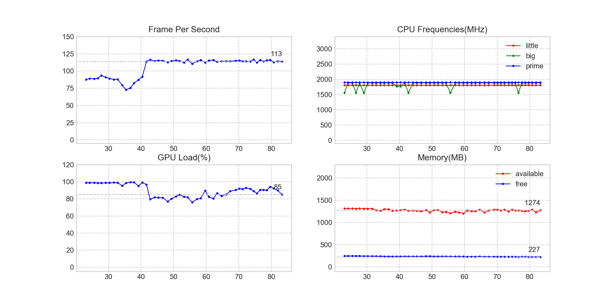

# FpsMonitor

监测 Android 设备内容实时刷新频率，使用方法：`python3 fps_monitor.py -i 300`

```bash
Usage: fps_monitor.py [options]

Options:
  -h, --help            show this help message and exit
  -i INTERVAL, --interval=INTERVAL
                        Interval of milliseconds to count frames
```

效果如下：


# License

Apache 2.0. See the [LICENSE](./LICENSE) file for details.